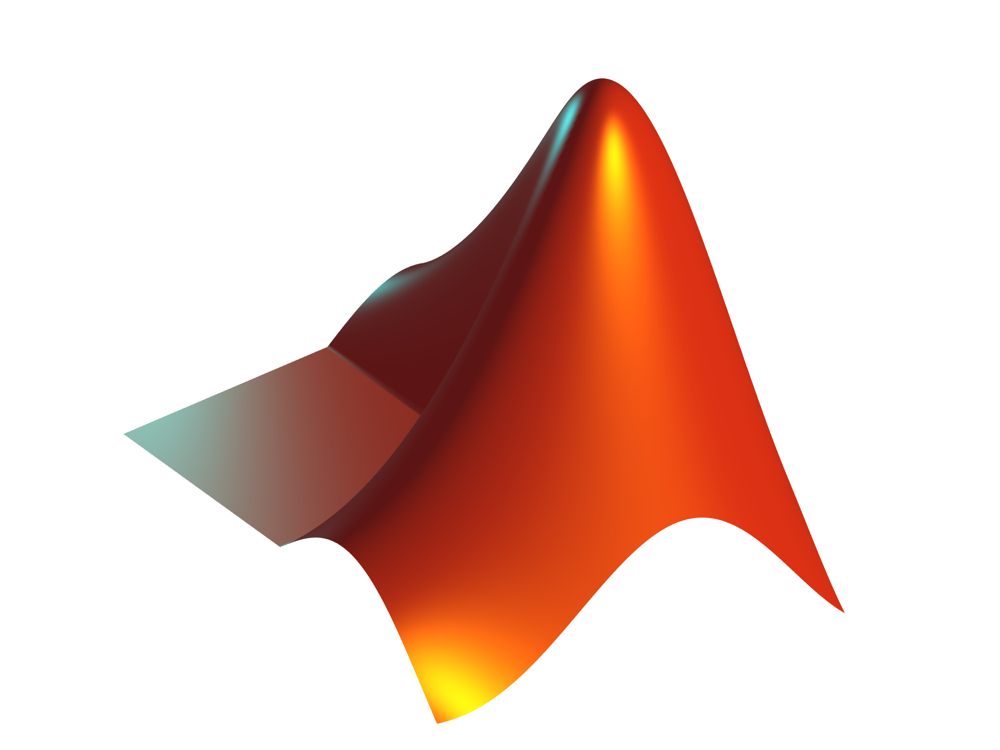

# MATLAB Logo Generator 📐

Generate MATLAB's iconic logo programmatically using the `membrane` function and 3D visualization.  

  


A MATLAB implementation to generate the iconic MATLAB logo using built-in functions and custom visualization settings.

## 📜 About
This project demonstrates how to recreate the MATLAB logo using MATLAB's `membrane` function and custom visualization settings. The MATLAB logo represents the L-shaped membrane eigenvalue problem, which is a classic example in numerical analysis and partial differential equations.

## ✨ Features
- Generates the iconic MATLAB logo programmatically
- Uses MATLAB's built-in `membrane` function for accurate results
- Customizable camera angles and lighting effects
- High-resolution output saving capabilities
- Professional visualization settings for publication-quality results

## 🚀 Quick Start

### Installation
1. Clone the repository:
   ```bash
   git clone https://github.com/fahadelahikhan/MATLAB-Logo-Code.git
   cd MATLAB-Logo-Code
   ```

2. Run the MATLAB script:
   ```matlab
   run('MATLAB_logo.m')
   ```

### Basic Usage
```matlab
% Generate the MATLAB logo with default settings
run('MATLAB_logo.m');

% To customize parameters, modify the MATLAB_logo.m file:
% - Adjust L = 160 * membrane(1, 100) for different membrane modes
% - Modify camera positions and lighting for different visual effects
% - Change the output filename in the print command
```

### Example Generation
```matlab
% Generate and save the MATLAB logo with custom settings
% Modify membrane mode
L = 200 * membrane(2, 100);  % Change mode from 1 to 2

% Adjust camera position
ax.CameraPosition = [-200 -300 350];  % More zoomed out view

% Save with custom filename
print('Custom_MATLAB_Logo', '-dpng', '-r300');
```

## 📖 How It Works
The MATLAB logo is based on the vibration modes of an L-shaped membrane. The `membrane` function solves the eigenvalue problem for the Laplace operator on the L-shaped domain. The visualization uses:
- Surface plotting with custom coloring
- Camera positioning for 3D perspective
- Multiple light sources for depth effect
- Anti-aliasing for smooth edges
- High-resolution rendering settings

The mathematical basis involves solving:
```
-Δu = λu  on the L-shaped domain
```
Where Δ is the Laplace operator and λ represents the eigenvalues.

## ⚖️ License
Distributed under the MIT License. See [LICENSE](LICENSE) for details.

---

> **Note**: This implementation is for educational and demonstration purposes. The generated logo should not be used for commercial purposes without proper authorization from MathWorks.
